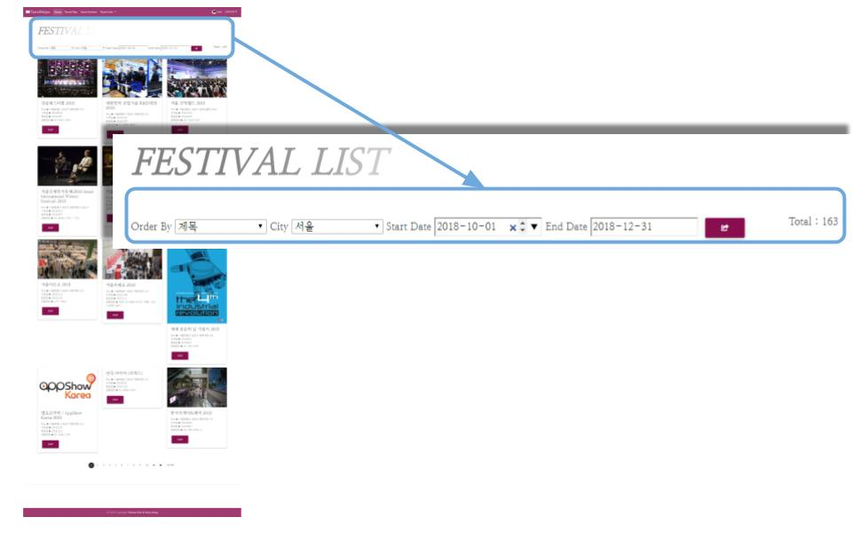
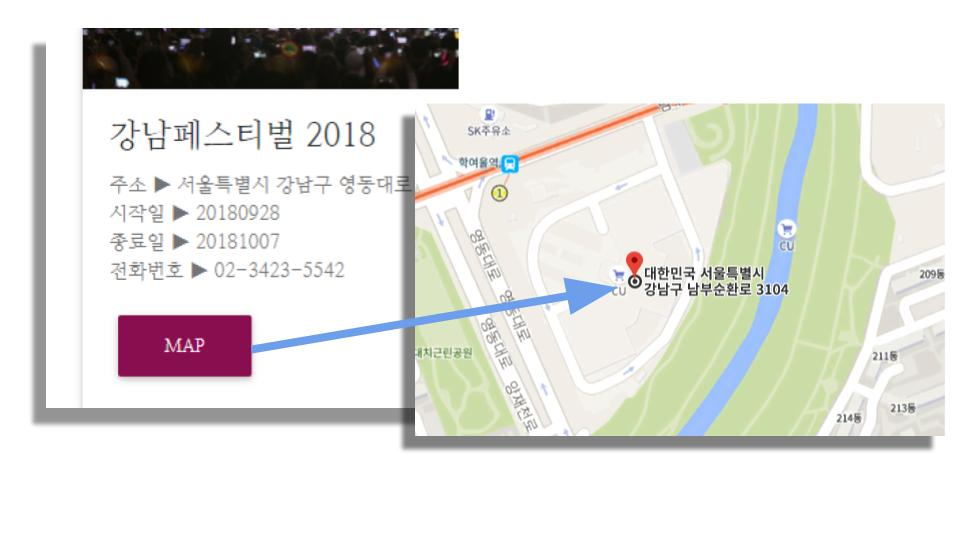

# [**TravelHelper-WebpageProject**](http://13.209.26.216:8080/travelhelper/)

Spring MVC 패턴으로 만든 여행계획, 후기 및 축제 정보가 업로드되는 반응형 웹사이트 입니다.
* 2018년 9월 ~ (진행중)
*  이 프로젝트의 **Tech Stack**
<pre><code>
jQuery / javascript / java / lombok / css3 /
html5 / oracle / tomcat8.5 / Spring / MDBootstrap /
Mybatis / JDBC / json / tinymce / Ajax
</pre></code>
* [**TravelHelper Link**](http://13.209.26.216:8080/travelhelper/)

	

 

## 메뉴별 기능 소개

	

### 1. Main Page
- iframe을 활용하여 메인페이지 background에 동영상 재생
- 공공데이터에서 제공되는 **오픈API(중기예보정보조회서비스)** 가 매일의 날씨 정보 출력
- 로그인 인터셉터

### 1-1. SignUp / LogIn

- 회원가입 기능(password 일치 여부 판단 / 전체 form 입력시 가입 가능 / Avata등록 등)
- 회원가입 시 비밀번호 암호화하여 저장

<pre><code>
public class SHA256Util {
	
	public static String generateSalt() {
		Random random = new Random();	// 랜덤 8바이트 데이터 생성(util의 random이용)
		byte[] salt = new byte[8];
		random.nextBytes(salt);	// 랜덤한 바이트 숫자로 8바이트를 채워준다. 호출시마다 다른 값이 들어감
		return byteToHexString(salt);
	}
	
	public static String getEncrypt(String source, String salt) { //매개변수(member.getPassword(), salt)

		byte[] bytes = (source + salt).getBytes();
		String result = "";

		try {
			MessageDigest md = MessageDigest.getInstance("SHA-256");
			md.update(bytes);//update원문
			
			byte[] byteData = md.digest();// 32바이트의 새로운 배열 생성
			// 바이트를 문자열로 변환
			result = byteToHexString(byteData);
		} catch (NoSuchAlgorithmException e) {
			e.printStackTrace();
		}
		return result;
	}
	
	// 코드중복 : 바이트를 문자열로 변환
	public static String byteToHexString(byte[] bytes) {
		StringBuilder sb = new StringBuilder();
		for (int i= 0; i<bytes.length; i ++) {
			sb.append(String.format("%02x",bytes[i]));
		}
		return sb.toString();
	}
}
</code></pre>

### 1-2. USER MANAGEMENT(ADMIN 계정만 사용가능)

- user level(NORMAL/SILVER/GOLD/ADMIN)별로 사용자 구분
- admin 계정으로 **point 추가/삭제** 기능

### 2. Travel Plan

- '여행 계획'을 업로드할 수 있는 게시판 페이지
- 각 게시물 별 **댓글 추가/삭제**기능
- pagination 기능

### 3. Travel Review

- '여행 후기'를 '사진'으로 업로드할 수 있는 Gallery
- '날짜별, 조회수별' 검색 기능
- 업로드한 사진 다운로드 기능
- pagination 기능

### 4. Festival Info

* 공공데이터에서 제공되는 **오픈API(국문 관광정보 서비스)** 로 축제 정보 출력
* '제목, 조회, 수정일, 인기순,지역별(시), 날짜별' **검색** 기능

* 각 Card의 Map버튼 클릭시 **구글맵에서 위치 표시** 기능

 

## 사용된 기술

#### 사용자 정의 뷰 사용

* Review 메뉴에서 목록의 썸네일 이미지, 상세보기의 Carousel **이미지 출력**
* Review 메뉴에서 상세보기의 Carousel **이미지 다운로드**

[사용자 정의 뷰(FileView 및 DownloadView)](./TravelHelper/src/main/java/edu/iot/travelhelper/view)를 사용했습니다.

<pre><code>
@Component("fileView")
public class FileView extends AbstractView {

	@Override
	protected void renderMergedOutputModel(
			Map<String, Object> model,
			HttpServletRequest request,
			HttpServletResponse response) throws Exception {
		
		String path = (String) model.get("path");
		String type = (String) model.get("type");
		
		File file = new File(path);
		
		// Header Setting
		response.setContentType(type);
		response.setContentLength((int) file.length());
		response.setHeader("Content-Transfer-Encoding", "binary");
		
		// Apache Commons IO
		FileUtils.copyFile(file, response.getOutputStream());
	}
	
}</code></pre>
  

#### 사용자 정의 태그 사용
css를 활용하여 타이틀 애니메이션 적용
자세한 내용은 [util](./TravelHelper/src/main/webapp/WEB-INF/tags/util) 폴더에 있습니다.

#### 페이지네이션
자세한 내용은 [common](./TravelHelper/src/main/webapp/WEB-INF/views/common) 폴더에 있습니다.

#### Ajax
* 게시물 삭제 및 댓글 작성 Ajax 처리
자세한 내용은 [view.jsp](./TravelHelper/src/main/webapp/WEB-INF/views/plan) 폴더에 있습니다.
<pre><code>
			$.get(url, params, function(result) {
				// 결과 응답 데이터는 result로 전달됨
				if(result == 'ok') {
					//javascript로 페이지 이동 location
					location = '../list';
				} else {
					alert('삭제 실패 : '+ result);
				}
			});
      </code></pre>

      $.get(url, params, function(result){
				// 결과 응답 데이터는 result로 전달됨.
				if(result == 'ok'){
					alert('댓글을 작성했습니다..');
					$('#comment').val("");
					$('#comments').append(`
 ` +
						commentWriterId + ` : ` + commentContent + `
 `);
				}else{
					alert('댓글 작성 실패 : ' + result);
				}
			});

